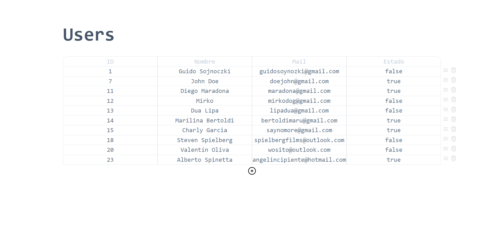
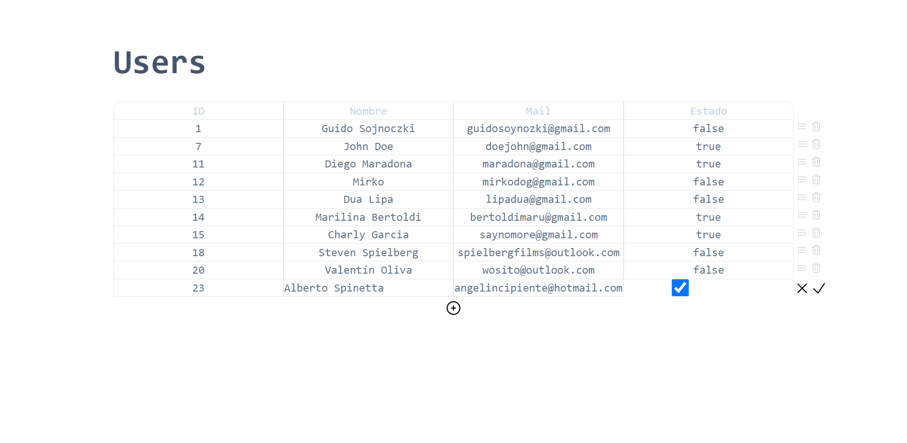
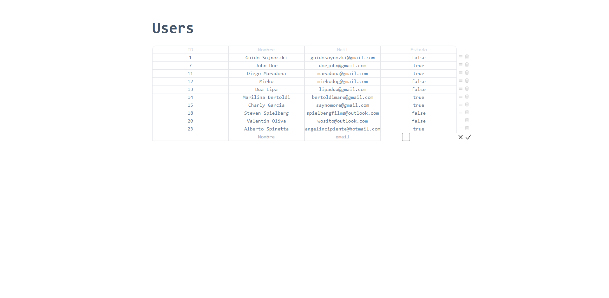

# Users admin panel

## Description

In this small practice project, I created a CRUD [REST api](https://github.com/guidocq/restAPI-node-tsc-mysql) of users and it's corresponding app to manage it

It's done with **react** and **tsc** and the style belongs to **tailwind.css**

## Functionality

### Read and delete

### Edit

### Update

### Create

